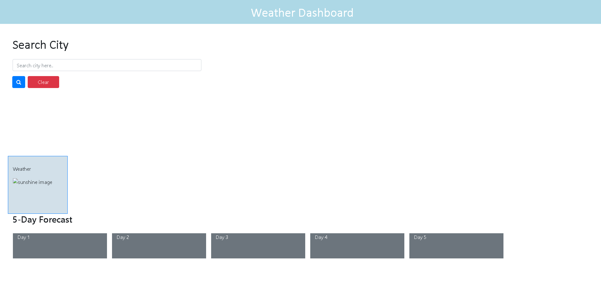

# weather-dashboard

## Description
This project was built so users could discover the weather for the current day and following 5 days after. It allows users to prepare for their day, if it rains the user could carry an umbrella around. They can wear different clothes depending on the temperature.

## Installation
N/A

## Usage

To use this application, the user must search up a city they desire. The temperature, humidity and wind will be displayed below the search bar of the desired city.

## Credits

N/a
## License
MIT

## Badges
